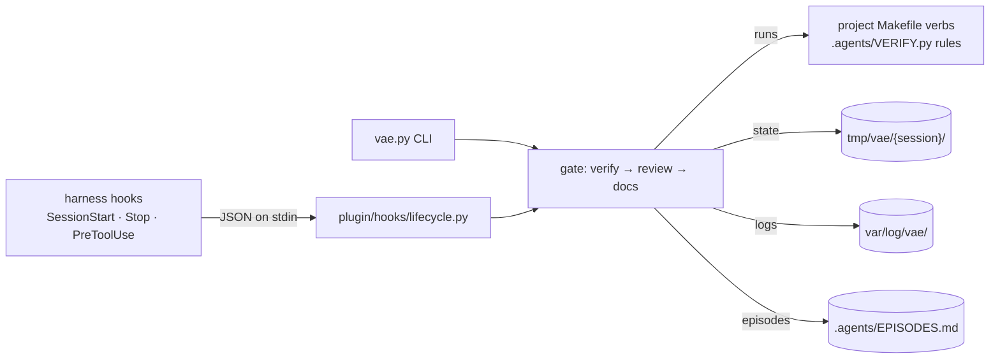

# Architecture: defuss-vae repository

This repository builds one artifact, the plugin in [`plugin/`](plugin/ARCH.md), and holds the maintainer tooling that proves it works: the `Makefile`, the tests in [`tests/`](tests/ARCH.md), lint config and CI. The gate contract itself is specified in [`docs/VERIFIER.md`](docs/VERIFIER.md); this page covers how the pieces fit and run.

## Why this design

Enforcement lives in small stdlib-only Python programs that the agent harness calls through hooks, not in prompts, because a prompt can be ignored and a denied `git commit` cannot. `plugin/` is exactly what users install, so maintainer files stay at the root and the release zip is the directory itself. `VERIFIED:` the e2e installs that zip into a fresh consumer project and drives only its CLI and hook adapter, so a file missing from the payload fails the build.

## How it works

The hook adapter and the CLI share one state machine, so the agent can loop the gate in-turn while the Stop hook blocks only once per turn. Maintainer flow: `make setup` installs uv if missing, `make verify` runs lint (pinned ruff and actionlint), tests, a Python 3.9 compatibility run, coverage, doctor and e2e; CI (`.github/workflows/verify.yml`) runs the same two commands on macOS and Ubuntu.

## Operations

- **Deployment:** a release is a version bump in the three manifests (kept equal by a test) pushed to `main`; Claude Code installs from the marketplace entry in `.claude-plugin/marketplace.json`, keyed by version.
- **Resources:** the gate's cost is the project's own suites; results are cached by a content fingerprint plus the policy files, so review and docs loops do not rerun them.
- **Reliability:** hooks fail closed (a crashing gate denies the commit and blocks the stop once) and never depend on `uv`, so a missing tool cannot open the gate.

## Security and privacy

The gate executes project code by design: `.agents/VERIFY.py` is imported and the Makefile verbs run in a shell with the user's permissions. That is the same trust the user already gives `make test`; the plugin adds no network access of its own. No personal data is processed: state and logs hold session ids, file paths and command output, all in gitignored `tmp/` and `var/`.
