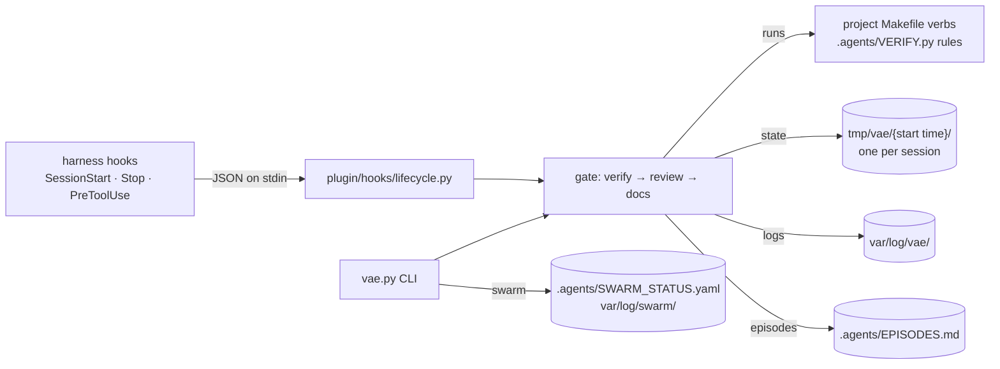

# Architecture: defuss-vae repository

This repository builds one artifact, the plugin in [`plugin/`](plugin/ARCH.md), and holds the project website in [`docs/index.html`](docs/index.html) and the maintainer tooling that proves both work: the `Makefile`, the tests in [`tests/`](tests/ARCH.md), lint and coverage config and CI. The gate contract itself is specified in [`docs/VERIFIER.md`](docs/VERIFIER.md); this page covers how the pieces fit and run.

## Why this design

Enforcement lives in small stdlib-only Python programs that the agent harness calls through hooks, not in prompts, because a prompt can be ignored and a denied `git commit` cannot. `plugin/` is exactly what users install, so maintainer files stay at the repository root and `make dist` zips the contents of `plugin/` without caches. `VERIFIED:` the e2e installs that zip into a fresh consumer project and drives only its CLI and hook adapter, so a file missing from the payload fails the build.

The website is one static page built on defuss-shadcn, which it loads from jsDelivr: plain HTML with one stylesheet and one small script of its own, and no build step, so `docs/` holds exactly the files a host serves and the browser e2e tests those files. A site generator would add a build whose output the tests would have to chase.

## How it works

The hook adapter and the CLI share one state machine, so the agent can loop the gate in-turn while the Stop hook blocks only once per turn. Outside the gate, the CLI keeps the sub-agent registry and starts detached jobs (`vae.py swarm`). Maintainer flow: `make setup` installs uv and bun if missing, then the locked dependencies of the site e2e; `make verify` runs lint (pinned ruff, actionlint and oxlint), tests, a Python 3.9 compatibility run, coverage, doctor and e2e, which drives the release zip's CLI and hooks and then the website in Chrome. CI (`.github/workflows/verify.yml`) runs the same two commands on macOS and Ubuntu.

## Operations

- **Deployment:** a release sets one version in the three manifests (`plugin/plugin.json`, `plugin/.claude-plugin/plugin.json`, `plugin/.codex-plugin/plugin.json`) and the version strings in `README.md`, turns `## Unreleased` in `CHANGELOG.md` into that version and is pushed to `main`; a test keeps the manifest and README versions equal. Claude Code installs from the marketplace entry in `.claude-plugin/marketplace.json`, which points at `./plugin`, and caches each version in its own directory, so an installed copy changes only on update (README, "Update an existing install").
- **Resources:** the gate costs the project's own suites plus about a tenth of a second of its own (README, "Speed": `make bench` on 0.6.0). Verify results are cached by a content hash of the changed code plus `.agents/VERIFY.py` and `.gitignore`, so the review and docs loops do not rerun the suites.
- **Reliability:** hooks fail closed (a crashing gate denies the commit and blocks the stop once) and run on plain `python3`, never `uv`: a hook command that cannot start is a non-blocking error in Claude Code and would let the commit through.

## Security and privacy

The gate executes project code by design: `.agents/VERIFY.py` is imported and the Makefile verbs run in a shell with the user's permissions. That is the same trust the user already gives `make test`, and `vae.py swarm spawn` runs the command it is given under the same trust. The gate and the CLI open no network connection; the `setup` verb of the Makefile template downloads a missing mise, uv or bun installer, then the pinned tools and locked dependencies, when `mise.toml` or a lockfile declares them ([`plugin/templates/ARCH.md`](plugin/templates/ARCH.md)). State and logs hold session ids, file paths and command output, all in gitignored `tmp/` and `var/`; the gitignored sub-agent registry adds the host name and absolute paths. In these files, a path or host name can contain the user's name, and command output holds whatever the project's commands print.

Besides its own host, the website requests files only from `cdn.jsdelivr.net`: defuss-shadcn 0.9.7 pinned with Subresource Integrity hashes, so a changed CDN file is refused instead of run. It sets no cookies, loads no analytics and stores one value in the visitor's `localStorage`: the dark-mode choice, once the visitor uses the switch.
