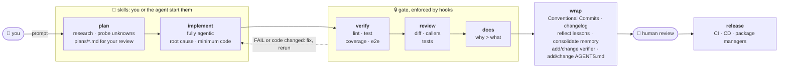
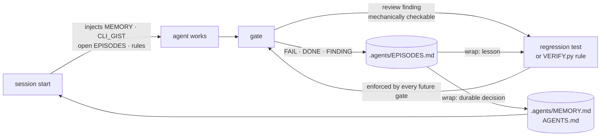

# defuss-vae

[](https://github.com/kyr0/defuss-vae/actions/workflows/verify.yml)
[](LICENSE)
[](plugin/ARCH.md)

**V**erified **A**gentic **E**ngineering: your coding agent ships only what it has proven works.

Seven skills and small stdlib-only Python programs that **verify, gate and remember**. The agent does the work and starts six of the skills when their step comes; you review risky plans before any code and start `wrap`, which commits. Programs, not prompts, decide whether the work is done.

## TL;DR

A prompt can ask a coding agent to run the tests, mock nothing and clean up its debug prints, but it cannot make the agent do it, and the next session starts without the lessons of the last one.

defuss-vae moves the checks out of the prompt and into code. Hooks deny `git commit` and send the agent back to work when it stops early, until the current code passes **verify → review → docs**. Lessons from failures are written into the project and loaded into the next session.

- 🔒 **Hard gate:** `git commit` is denied until the exact code fingerprint is verified, reviewed and documented
- 📝 **Docs are gated too:** every changed page passes a static prose check (em dashes, invisible or look-alike characters, broken links, fences and diagrams) and a review against a universal prose catalog
- 🧯 **Fails closed:** a crashing gate blocks instead of waving changes through
- 🧪 **Real evidence:** lint, tests (no mocks), coverage ≥ 60 %, and an e2e run against the built artifact that must leave fresh output
- ♻️ **Cached by content:** verification reruns only when code, pages or policy change, so review/docs loops stay fast
- 🧠 **Learns per project:** failures become episodes, every lesson becomes a test, a verifier rule or a memory line with its reason, and memory is loaded into every new session
- 🧭 **Adapts to your repo:** uses your Makefile, your toolchain (defaults for Go, Rust, JVM, .NET, JS/TS and Python) and your rules, and grows its policy from your own mistakes
- 🐝 **Sub-agents without collisions:** each agent claims disjoint paths in its own git worktree, long jobs run detached with timestamped logs, and `status` checks every claim against the process table
- 🙋 **Human in charge, no micro-management:** the agent starts a skill only when that skill's condition holds, a risky task without your plan gets one for your review first, only you start `wrap`, and nothing is pushed or released without you
- 🪶 **Tiny:** `python3` ≥ 3.9, `git`, `make`; no dependencies, no daemon, no `uv` in the hook path

## How it works



| Stage | Who drives it | What it does |
|---|---|---|
| **plan** | you; the agent only for a risky task you gave no plan for | Traces the real code path, probes unknowns instead of guessing, prefers existing helpers and stdlib, and writes the smallest plan, in which every acceptance criterion is an executable check, to `plans/<yyyy-mm-dd_hh-mm>_<slug>.md`. Complex work gets milestones, and work that splits safely gets its sub-agents planned. A plan the agent started waits for your review. |
| **implement** | you or the agent, fully agentic | Understands first, fixes the root cause (and its sibling callers), writes the minimum code, adds tests against real subsystems, and loops the gate in-turn. |
| **verify** | the agent at a goal or milestone; you any time | Reviews against requirements, callers and tests, and fixes the defects it confirms: the whole change when it is large, otherwise its paths and tests, because a deep review costs time and tokens. |
| **gate** | hooks, automatic | **verify** runs the project's own `make` verbs; **review** checks requirements, every changed path and its callers; **docs** records *why* this design beats the plausible alternative. Doc pages get a static prose check and a review against the prose catalog instead of the test suites. Any edit changes the fingerprint and restarts the gate. |
| **doc** | you any time; the agent after implementing | Writes and checks documentation pages: claims grounded in code and tests, page-specific rules declared before writing, Mermaid where the content is schematic, then the static prose check and a catalog review. Pages state what is; history belongs in the changelog. |
| **doc-edit** | you any time; the agent after `doc` | Edits only the named pages, as instructed: the same grounding, catalog review and static check, limited to the changed parts. |
| **wrap** | only you, since it commits | Splits the work into coherent Conventional Commits, updates `CHANGELOG.md`, turns what the work taught into tests, `.agents/VERIFY.py` rules or concise memory lines with their reason, consolidates agent memory, and updates the managed block in `AGENTS.md`. |
| **status** | you or the agent, any time | Shows what runs (sub-agents, the service, free disk, RAM and GPU), reconciles `.agents/SWARM_STATUS.yaml` with the process table, and names the next step per agent. |
| **human review** | you | You read the commits. Nothing has been pushed yet. |
| **release** | you, via CI/CD | Push, tag, publish to package managers. On GitHub, `init` adds `.github/workflows/verify.yml`: the tools `mise.toml` pins via `jdx/mise-action`, uv or bun from their official setup actions, then `make setup` and `make verify` (or the commands in `CONFIG["ci"]`; `False` adds no workflow), so CI runs the same gate. |

## It adapts to your project

defuss-vae doesn't ship one-size-fits-all checks. It enforces a small **contract**, and each project fills that contract with its own commands and grows it with its own lessons.

- **Your commands, not autodiscovery.** The verifier runs your `Makefile` verbs (`make lint`, `make test`, `make coverage`, `make e2e`), so Python, TypeScript, Go, Rust, Java and C# all go through the same gate. When a verb is missing, the gate cites the detected stack's default from [`plugin/references/STACKS.md`](plugin/references/STACKS.md), and session start injects only the defaults of the stacks a repository uses. `.agents/VERIFY.py` can point any check at a different command. *Why:* guessing runners per ecosystem would verify commands the project never committed to.
- **Your toolchain stays.** A repo already on npm, poetry or anything else keeps it; migrating needs your approval. Only *new* projects start on `bun` or `uv`, and the gate rejects foreign lockfiles that newly appear. Tool versions live in `mise.toml`: `make setup` runs `mise install`, and CI uses `jdx/mise-action`.
- **Scaffolds only what's missing.** `vae.py init` adds `.agents/`, a template `Makefile` (a bare `make` lists every verb with its usage; it exports the `.env` keys to every recipe and to the app `make start` runs), `.gitignore` lines, a managed `AGENTS.md` block and (on GitHub) the CI workflow. It never overwrites files the project already has.
- **Executable policy that grows.** `.agents/VERIFY.py` is project-local Python config plus deterministic rules (`command`, `file_exists`, `contains`, `regex`, `not_regex`). When review finds a bug class that can be checked mechanically, it becomes a regression test or a rule, which every future gate then enforces.
- **Rules per doc page.** Every page is under the built-in prose check from the moment it exists. A page with its own invariant (a required section, a diagram that must stay) gets a `.agents/VERIFY.py` rule before it is written, and a page whose house style needs a flagged character (German `„“` quotes, say) allows it via `CONFIG["prose"]["allow"]`.
- **Memory that's actually loaded.** The gate logs `FAIL`/`DONE`/`FINDING` lines to `.agents/EPISODES.md`. Past 100 entries the gate trims only its own oldest noise, never an unsettled lesson. `wrap` promotes every lesson to a test, a rule or one concise `.agents/MEMORY.md` line that states its reason (`BC`; ≤ 4 KiB in all), or deletes it with evidence; it records the commands that worked in `.agents/CLI_GIST.md` (≤ 2 KiB). The SessionStart hook injects MEMORY and CLI_GIST into every new session, so lessons don't depend on the agent remembering to read a file; of the episodes only the three newest open ones (unencoded lessons, failures their session never turned green) arrive, labeled as leads, and `plan`, `implement` and `verify` grep the rest by touched path or symptom. Session start also lists the live sub-agents and the defaults of the stacks present; when not everything fits in 9,000 characters, it cuts by priority between lines (MEMORY before CLI_GIST, the stack defaults and the leads) and names what it left out. Because stale memory would mislead every session, `wrap` audits each entry against the current code and removes or rewrites one only with evidence; an entry it can't settle stays, tagged `UNKNOWN`, and `doctor --repo .` lists entries that cite paths which no longer exist.



Lessons are ranked by strength: **test or `VERIFY.py` rule > MEMORY line > EPISODES line**. The strongest form is one a program enforces.

## Install

Requirements: `python3` ≥ 3.9, `git`, `make`. Hooks and CLI are stdlib-only.

### Claude Code (recommended: plugin, includes hooks)

Inside Claude Code:

```text
/plugin marketplace add kyr0/defuss-vae
/plugin install defuss-vae@defuss-vae
```

Or from your shell:

```bash
claude plugin marketplace add kyr0/defuss-vae
claude plugin install defuss-vae@defuss-vae
```

Start a new session afterwards. To update later, see [Update an existing install](#update-an-existing-install). To use a local checkout instead, start Claude Code in your project with `claude --plugin-dir <checkout>/plugin`.

- **Good for:** the full experience, with the commit gate, the Stop-hook gate, and memory injected at session start.
- **Auto mode:** the gate asks the agent to record its review and docs check in `review.json` and `docs.json` under `tmp/vae/`, and Claude Code's auto-mode classifier can block that write as `[Logging/Audit Tampering]` (seen with Claude Code 2.1.292). Tell the classifier the write is expected: add this entry to `~/.claude/settings.json` (the classifier never reads `autoMode` from project settings), and keep `"$defaults"`, or the built-in exceptions are dropped. `claude auto-mode config` shows whether it took effect.

```json
{
  "autoMode": {
    "allow": [
      "$defaults",
      "defuss-vae attestations: after reviewing, writing review.json or docs.json under tmp/vae/ is the defuss-vae gate's own workflow; it records the review and disables no logging or audit control"
    ]
  }
}
```

### Codex (plugin)

`plugin/plugin.json` (Agent Plugins 1.0) + `plugin/.codex-plugin/plugin.json`; trust the hooks via `/hooks`.

- **Drawbacks:** hook parity with Claude Code is untested, see [`docs/COMPATIBILITY.md`](docs/COMPATIBILITY.md).

### Cursor, Gemini CLI, Copilot, Windsurf and more (skills only)

The open [`skills`](https://www.npmjs.com/package/skills) CLI detects your agents and installs the skills into any Agent Skills host:

```bash
npx skills add kyr0/defuss-vae --skill '*'
```

Pick agents with repeated `--agent` (`claude-code`, `codex`, `cursor`, `gemini-cli`, `github-copilot`, `windsurf`, or `'*'`) and skills with repeated `--skill`. Add `--global` (`-g`) for all projects, `--yes` (`-y`) for scripts, or `--list` to see what's available:

```bash
npx skills add kyr0/defuss-vae --skill plan --skill implement --agent codex --agent cursor
npx skills add kyr0/defuss-vae --skill '*' --agent codex --global --yes
npx skills update
```

- **Good for:** bringing the plan, implement, verify, doc, doc-edit, wrap and status discipline to any agent.
- **Drawbacks:** this route copies only `plugin/skills/`, with **no hooks and no CLI**. Nothing blocks `git commit`, and the skills' `vae.py` path doesn't resolve. Clone the repo once and run the gate yourself:

```bash
git clone https://github.com/kyr0/defuss-vae ~/defuss-vae
python3 ~/defuss-vae/plugin/scripts/vae.py gate --repo .
```

In Claude Code prefer the plugin: its skills are namespaced (`/defuss-vae:plan`), while skills-CLI installs are not (`/plan`).

## Update an existing install

A new release doesn't reach an installed copy on its own. Each harness keeps the version it installed (Claude Code caches every plugin version in its own directory), and Claude Code's auto-update is off by default for third-party marketplaces like this one. Run the command for your harness and the way you installed:

| Harness | Installed as | Update with |
|---|---|---|
| Claude Code | plugin | `claude plugin update defuss-vae@defuss-vae`, or in a session `/plugin` → **Installed** → defuss-vae → **Update now** |
| Claude Code | local checkout (`--plugin-dir`) | `git -C <checkout> pull` |
| Codex | plugin | `codex plugin marketplace upgrade`, then reinstall defuss-vae from `/plugins` and review its hooks in `/hooks` (untested) |
| GitHub Copilot CLI | plugin | `copilot plugin update defuss-vae` (untested) |
| Claude Code, Codex, Cursor, Gemini CLI, Copilot, Windsurf | skills (`npx skills add`) | `npx skills update`; add `-g` for global installs, `-y` to skip the prompt |
| any skills-only host | gate clone | `git -C ~/defuss-vae pull` |

With the skills CLI, if a skill added in a later release is missing afterwards, add it by name, e.g. `npx skills add kyr0/defuss-vae --skill doc-edit` (`doc-edit` and `status` are new in 0.6.0). The same release renamed `docs`, `review` and `finalize` to `doc`, `verify` and `wrap`; remove the old copies with `npx skills remove docs review finalize`.

Then activate it. A running session keeps the version it loaded, so in Claude Code run `/reload-plugins` or start a new session; in other harnesses start a new session. Check the installed version with `claude plugin list` (Claude Code) or `npx skills list` (skills CLI):

```text
❯ defuss-vae@defuss-vae
  Version: 0.7.1
  Scope: user
  Status: ✔ enabled
```

To get new releases in Claude Code without asking, turn on auto-update: `/plugin` → **Marketplaces** → defuss-vae → **Enable auto-update**. Claude Code then updates the plugin in the background during a session, and the new version loads the next time you start it.

## Usage

You can start any skill, and the agent starts six of them when their step comes: `status` any time; `implement` for a task you gave or a plan you approved; `verify` at the task's goal or a plan milestone, on the whole change when it is large and otherwise on its paths and tests; `doc` after implementing and `doc-edit` after `doc`; `plan` only when you gave no plan and the task is too risky or complex to do directly, and that plan then waits for your review. No agent starts `wrap`, because it commits: `disable-model-invocation` in Claude Code and `allow_implicit_invocation: false` in Codex keep it yours, and `vae.py swarm spawn` refuses a command that names it. The form depends on how you installed:

| Installed via | Invocation |
|---|---|
| Claude Code plugin | `/defuss-vae:plan <request>` |
| Claude Code, skills CLI | `/plan <request>` |
| Codex | `$plan <request>` |

The examples below use the plugin form; swap the prefix for your host. Everything after the skill name is your request in plain words.

### Plan: research and a spec before any code

Describe the goal and its constraints. `plan` reads the code, traces the real path, and probes what it doesn't know by running existing commands or scratch scripts in `tmp/`; its rules forbid editing source. It writes the plan to `plans/<yyyy-mm-dd_hh-mm>_<slug>.md` (UTC) and updates that file as you refine it: steps that each name the file and symbol, the change and the check that will prove it; milestones to tick off when the work turns out complex, each followed by a `verify` of its scope; and, when units have disjoint paths and none depends on another's code, the sub-agents with goal, targets, contract, ETA and worktree. Its reply names the file, what's `VERIFIED`, what's `UNKNOWN` and how to find out, the prior art it reuses, and the decision. Refine it by replying in plain words ("drop the Redis option, reuse the in-memory limiter"); when the plan is right, run `implement`.

```text
/defuss-vae:plan add rate limiting to the upload endpoint: 10 requests/min per API key, 429 with Retry-After
/defuss-vae:plan fix: uploads over 2 GB fail with 413 behind nginx; reproduce it first
/defuss-vae:plan migrate the config loader from YAML to TOML, then implement it
```

The last one plans and implements in one go; without "then implement it", `plan` stops at the spec.

### Implement: build it, then loop the gate

```text
/defuss-vae:implement
/defuss-vae:implement add a --json flag to `export` that prints one object per line
```

Without a request it implements the plan from the conversation or `plans/`; with one it works on that task directly. Either way it reruns the gate until `VERIFIED[gate]=true`, and at the goal or a plan milestone it starts `verify`, then `doc` when a page describes changed behavior.

### Verify: a deep review at milestones

```text
/defuss-vae:verify
/defuss-vae:verify src/upload.py and its tests
/defuss-vae:verify report only, don't edit anything
```

By default it reviews the current changes and fixes what it finds; name paths or tests to narrow it. The agent starts it at the task's goal or a plan milestone. The gate already runs a review before every commit; call this one yourself when you want a second, deeper look. It is the reviewing counterpart of `make verify`, which runs only the deterministic suites.

### Doc: write or check documentation pages

```text
/defuss-vae:doc write docs/ARCHITECTURE.md explaining the request flow for new contributors
/defuss-vae:doc check README.md against the prose catalog and fix what it finds
```

### Doc-edit: change one page as instructed

```text
/defuss-vae:doc-edit README.md: add the --json flag to the CLI table
```

It edits only the named pages and leaves the rest of each page alone, except for prose-check hits the gate would block on, which it fixes minimally and reports.

### Wrap: commits, changelog, lessons, memory

```text
/defuss-vae:wrap
/defuss-vae:wrap and push
```

`wrap` never pushes, merges or releases unless you ask for it, as in the second line.

### Status: what runs, and whether the record matches

```text
/defuss-vae:status
/defuss-vae:status and respawn whatever crashed
```

It lists free disk, RAM and GPU and every registered agent with its state (`RUNNING`, `EXITED`, `LOST`, `STALLED`, `OVERDUE`, `MALFORMED`, or `UNKNOWN` for an entry from another host), flags `CONFLICT` claims and an `OVERCOMMIT` of RAM, records drift with `vae.py swarm status --fix`, and names the next step per agent. Run it after an SSH drop or a crash.

### Sub-agents and long runs

One hard rule decides whether work splits: units must have disjoint target paths and explicit contracts; otherwise the work stays sequential. A plan names the split and each unit's worktree. Each unit gets its own git worktree outside the repository (`../<repo>.wt/<name>`), or under `tmp/worktrees/<name>` when the harness blocks writes outside it, in which case the project's test discovery must skip `tmp/`. Each unit works in small chunks and writes its results to disk early, and a spawned session never runs `wrap`.

```bash
git worktree add ../app.wt/parser -b swarm/parser
python3 plugin/scripts/vae.py swarm spawn --name parser --goal "Port the parser to the new AST." \
  --workdir ../app.wt/parser --targets src/parser,tests/parser --eta 40 --ram 2G -- claude -p "…"
python3 plugin/scripts/vae.py swarm status            # exit 1 when an agent needs the orchestrator
python3 plugin/scripts/vae.py swarm rm --name parser  # after its worktree is merged
```

`spawn` runs any agent CLI or script in its own session, so an SSH drop or a dying shell cannot kill it. It appends each output line with an ISO-8601 timestamp to `var/log/swarm/<name>.log` and records the exit code. It refuses a claim that overlaps a live agent's workdir or targets, and an estimate beyond the free disk, RAM or VRAM. `.agents/SWARM_STATUS.yaml` holds one entry per live agent, with `name`, `pid`, `host`, `goal`, `exit_code`, `workdir`, `target_focus_paths`, `start_timestamp`, `eta_in_mins`, `estimated_ram_usage`, `estimated_vram_usage`, `estimated_disk_space_usage`, `gpu_id`, `container_id` and `pwd`. It lives at the main worktree root and is gitignored. Only the process an entry names, or a descendant of it, may change that entry; every write takes a lock, replaces the file atomically and is re-read after 3 seconds. `status` judges liveness from the process table, and a pid that is gone, or that a later process reuses, makes its entry `LOST`. A power-off stops every process, but the registry, the logs and the results written early survive it, so the next `status` finds the dead agents for the orchestrator to restart. The orchestrator checks back on a timer (its harness scheduler, or cron) every quarter of the expected runtime, between 5 and 30 minutes.

The gate itself needs no command. When the agent tries to finish, or to `git commit`, the hooks run it and hand back exactly what's missing.

## CLI

```bash
python3 plugin/scripts/vae.py init   --repo .   # scaffold what's missing (.agents/, Makefile, .gitignore, AGENTS.md, CI)
python3 plugin/scripts/vae.py gate   --repo .   # verify → review → docs; exit 0 when done
python3 plugin/scripts/vae.py verify --repo .   # verifier only
python3 plugin/scripts/vae.py prose  --repo .   # static prose check of every doc page; --fix applies safe replacements
python3 plugin/scripts/vae.py doctor --repo .   # memory budgets, epistemic tags, layout
python3 plugin/scripts/vae.py swarm status      # free resources + each sub-agent's state; spawn|set|rm|stop manage the registry
```

Full reference with exit codes: [`plugin/scripts/README.md`](plugin/scripts/README.md).

## What "verified" means

The verifier passes only with direct evidence for **all** of the following. A missing command or metric counts as `UNKNOWN`, and `UNKNOWN` fails.

- `.agents/VERIFY.py` is present and every one of its rules holds
- `make verify` is wired to `lint test coverage e2e`, and lint passes
- tests exist and pass, using real subsystems (a throwaway database, queue or local server process) instead of mock frameworks, and never live or production data
- e2e builds the publishable artifact, consumes it like a user, and leaves fresh evidence in `output/`. The rules ask e2e to reach every page, route or component of a UI (in a real browser) and every CLI command or API endpoint at least once; the gate can't check that mechanically, so review does
- coverage ≥ 60 % (`make coverage` prints `TOTAL <n>%`, a `total:` or `| Total |` row, or an `All files |` table)
- no leftover temporary probe lines, no newly added foreign toolchain, and an `.env.example` that lists every config key
- a `README.md` at the root and for every package with a changed CLI or API, and an `ARCH.md` for every package with changed production code or deployment and schema definitions (not tests, examples, docs, config or data). A page covers the folders below it up to the next package manifest. Both state only verified facts. Templates are in `plugin/templates/`
- every changed `package.json` sets `packageManager` (bun), description, license and author; a new package is also `"type": "module"`, lints with oxlint and, as a library, builds with pkgroll
- every changed doc page passes `vae.py prose`.

The page, `.gitignore` and `package.json` checks block where `.agents/VERIFY.py` sets `CONFIG["strict"]=True`, which the template does for every project created with 0.6.0 or later. A project created earlier keeps them as warnings (listed under `WARNS:`) until it sets that key. A session that changed only pages runs the prose check and the project rules, and skips the test suites.

The layout is the same everywhere: `Makefile` verbs `setup start stop status log metrics bench test coverage lint e2e verify`; services log to `var/log/<svc>.stdout|.stderr` with a pid in `tmp/<svc>.pid`; programs read `input/` and write `output/`; config comes from a gitignored `.env`, with every key listed in a committed `.env.example` (verified: a key that code reads or `.env` sets but the example lacks fails the gate). `.gitignore` must cover `.env`, `var/`, `tmp/`, `output/` and `dist/`, plus the cache, package and build folders of each toolchain present (`node_modules/`, `.venv/`, `__pycache__/`, `target/`, `bin/`, `obj/`, `build/`, `.gradle/` and the like); `vae.py init` appends them, plus `.agents/SWARM_STATUS.yaml`, the live sub-agent registry.

A project without a service (a library, a CLI tool) still has the service verbs, as one Makefile line:

```make
start stop restart status log: ; @echo "∅ $@: no service"
```

`make status` then answers "no service" instead of failing on a missing target, and the `var/`, `tmp/` and `.env` ignore checks stay on. The layout check suggests this line when the verbs are missing. `CONFIG["layout"]=False` would also silence it, but it drops those ignore checks, so treat it as a last resort.

## Speed

The gate adds about a tenth of a second to your own suites. Measured with `make bench`, the 0.6.0 release installed into a small consumer project, medians of 7 runs, Apple M4, macOS 15.7.3, Python 3.14.3, 2026-10-07:

| What | Median |
|---|---|
| PreToolUse hook on a command that isn't a commit (runs before every Bash call) | 18 ms (Python startup alone: 14 ms) |
| SessionStart hook | 68 ms |
| Gate with nothing changed since its last run (the review and docs loop) | 91 ms |
| Gate after a page edit, with the suites already green | 92 ms |
| Stop hook, and the commit check, on a cached gate | 86 ms |
| Gate cold, running the project's suites | 328 ms, of which 222 ms are the project's own lint, test, coverage and e2e |

So on a cold run the gate's own share is about 105 ms; the rest is your suites, which the gate runs once per code change and then caches. Most of a cached run is five `git` subprocesses. In this repository, `make bench` reproduces the numbers into `output/bench.json`.

## Enforcement boundary

`VERIFIED:` hooks prove command results, fingerprints, layout and commit gating, and the e2e suite drives the released zip's own hook adapter to show it.
`VERIFIED:` the gate checks that a complete review attestation exists for the current code, not how insightful the review was. Review quality stays with the model, which is why human review sits before release.
`VERIFIED:` (`tests/test_swarm.py`) the swarm CLI refuses overlapping claims and writes by a non-owner, and re-applies a write that a racing editor dropped. An agent that edits the YAML by hand bypasses the first two checks; the next `status` run still judges every entry by the process table.

## Details

- Architecture of this repository: [`ARCH.md`](ARCH.md)
- Prose catalog for doc pages: [`plugin/references/PROSE.md`](plugin/references/PROSE.md)
- Prompt and rule design: [`docs/PROMPT_DESIGN.md`](docs/PROMPT_DESIGN.md); the canonical VAE-DIALECT: [`plugin/references/VAE-DIALECT.md`](plugin/references/VAE-DIALECT.md)
- Gate and verifier design: [`docs/VERIFIER.md`](docs/VERIFIER.md); host support: [`docs/COMPATIBILITY.md`](docs/COMPATIBILITY.md)
- Contributing: [`AGENTS.md`](AGENTS.md); run `make setup && make verify`

## Citation

If you use defuss-vae in research or want to reference it, cite it as:

```bibtex
@misc{homberg2026defussvae,
  author       = {Homberg, Aron},
  affiliation  = {Independent Researcher},
  title        = {defuss-vae: Verified Agentic Engineering},
  year         = {2026},
  version      = {0.7.1},
  howpublished = {\url{https://github.com/kyr0/defuss-vae}},
  note         = {Claude Code and Agent Skills plugin, MIT License}
}
```

## License

MIT
