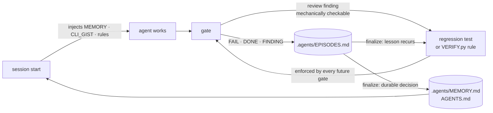

# defuss-vae

[](https://github.com/kyr0/defuss-vae/actions/workflows/verify.yml)
[](LICENSE)
[](plugin/ARCH.md)

**V**erified **A**gentic **E**ngineering: your coding agent ships only what it has proven works.

Five skills that you trigger yourself, plus small stdlib-only Python programs that **verify, gate and remember**. The agent does the work; programs, not prompts, decide whether that work is done.

## TL;DR

A prompt can ask a coding agent to run the tests, mock nothing and clean up its debug prints, but it cannot make the agent do it, and the next session starts without the lessons of the last one.

defuss-vae moves the checks out of the prompt and into code. Hooks deny `git commit` and send the agent back to work when it stops early, until the current code passes **verify → review → docs**. Lessons from failures are written into the project and loaded into the next session.

- 🔒 **Hard gate:** `git commit` is denied until the exact code fingerprint is verified, reviewed and documented
- 📝 **Docs are gated too:** every changed page passes a static prose check (em dashes, invisible or look-alike characters, broken links, fences and diagrams) and a review against a universal prose catalog
- 🧯 **Fails closed:** a crashing gate blocks instead of waving changes through
- 🧪 **Real evidence:** lint, tests (no mocks), coverage ≥ 60 %, and an e2e run against the built artifact that must leave fresh output
- ♻️ **Cached by content:** verification reruns only when code, pages or policy change, so review/docs loops stay fast
- 🧠 **Learns per project:** failures become episodes, recurring ones become tests or verifier rules, and memory is loaded into every new session
- 🧭 **Adapts to your repo:** uses your Makefile, your toolchain and your rules, and grows its policy from your own mistakes
- 🙋 **Human in charge:** skills never trigger themselves, and nothing is pushed or released without you
- 🪶 **Tiny:** `python3` ≥ 3.9, `git`, `make`; no dependencies, no daemon, no `uv` in the hook path

## How it works

```mermaid
flowchart LR
    H([🙋 you]) -->|"prompt"| P

    subgraph agent ["🤖 skills you trigger, agent works"]
        P["<b>plan</b><br/>research · probe unknowns<br/>refine · spec with checks"]
        I["<b>implement</b><br/>fully agentic<br/>root cause · minimum code"]
        P --> I
    end

    subgraph gate ["🔒 gate, enforced by hooks"]
        V["<b>verify</b><br/>lint · test<br/>coverage · e2e"]
        R["<b>review</b><br/>diff · callers<br/>tests"]
        D["<b>docs</b><br/>why > what"]
        V --> R --> D
    end

    I --> V
    gate -.->|"FAIL or code changed: fix, rerun"| I
    D --> F["<b>finalize</b><br/>Conventional Commits · changelog<br/>reconcile agent memory<br/>add/change verifier · add/change AGENTS.md"]
    F --> HR([🙋 human review])
    HR --> REL["<b>release</b><br/>CI · CD · package managers"]
```



| Stage | Who drives it | What it does |
|---|---|---|
| **plan** | you trigger, agent works | Traces the real code path, probes unknowns instead of guessing, prefers existing helpers and stdlib, and emits the smallest plan in which every acceptance criterion is an executable check. |
| **implement** | you trigger, fully agentic | Understands first, fixes the root cause (and its sibling callers), writes the minimum code, adds tests against real subsystems, and loops the gate in-turn. |
| **gate** | hooks, automatic | **verify** runs the project's own `make` verbs; **review** checks requirements, every changed path and its callers; **docs** records *why* this design beats the plausible alternative. Doc pages get a static prose check and a review against the prose catalog instead of the test suites. Any edit changes the fingerprint and restarts the gate. |
| **docs** | you trigger, any time | Writes and checks documentation pages: claims grounded in code and tests, page-specific rules declared before writing, Mermaid where the content is schematic, then the static prose check and a catalog review. |
| **finalize** | you trigger | Splits the work into coherent Conventional Commits, updates `CHANGELOG.md`, reconciles agent memory, promotes recurring lessons into tests or `.agents/VERIFY.py` rules, and updates the managed block in `AGENTS.md`. |
| **human review** | you | You read the commits. Nothing has been pushed yet. |
| **release** | you, via CI/CD | Push, tag, publish to package managers. On GitHub, `init` adds `.github/workflows/verify.yml` (`make setup && make verify`), so CI runs the same gate. |

## It adapts to your project

defuss-vae doesn't ship one-size-fits-all checks. It enforces a small **contract**, and each project fills that contract with its own commands and grows it with its own lessons.

- **Your commands, not autodiscovery.** The verifier runs your `Makefile` verbs (`make lint`, `make test`, `make coverage`, `make e2e`), so Python, TypeScript, Go and Rust all go through the same gate. `.agents/VERIFY.py` can point any check at a different command. *Why:* guessing runners per ecosystem would verify commands the project never committed to.
- **Your toolchain stays.** A repo already on npm, poetry or anything else keeps it; migrating needs your approval. Only *new* projects start on `bun` or `uv`, and the gate rejects foreign lockfiles that newly appear.
- **Scaffolds only what's missing.** `vae.py init` adds `.agents/`, a template `Makefile`, `.gitignore` lines, a managed `AGENTS.md` block and (on GitHub) the CI workflow. It never overwrites files the project already has.
- **Executable policy that grows.** `.agents/VERIFY.py` is project-local Python config plus deterministic rules (`command`, `file_exists`, `contains`, `regex`, `not_regex`). When review finds a bug class that can be checked mechanically, it becomes a regression test or a rule, which every future gate then enforces.
- **Rules per doc page.** Every page is under the built-in prose check from the moment it exists. A page with its own invariant (a required section, a diagram that must stay) gets a `.agents/VERIFY.py` rule before it is written, and a page whose house style needs a flagged character (German `„“` quotes, say) allows it via `CONFIG["prose"]["allow"]`.
- **Memory that's actually loaded.** The gate logs `FAIL`/`DONE`/`FINDING` lines to `.agents/EPISODES.md`. `finalize` folds durable lessons into `.agents/MEMORY.md` (≤ 4 KiB) and the commands that worked into `.agents/CLI_GIST.md` (≤ 2 KiB). The SessionStart hook injects MEMORY and CLI_GIST into every new session, so lessons don't depend on the agent remembering to read a file; episodes are not injected, and `plan`, `implement` and `review` grep them by touched path or symptom. Because stale memory would mislead every session, `finalize` audits each entry against the current code and removes or rewrites one only with evidence; an entry it can't settle stays, tagged `UNKNOWN`, and `doctor --repo .` lists entries that cite paths which no longer exist.



Lessons are ranked by strength: **test or `VERIFY.py` rule > MEMORY line > EPISODES line**. The strongest form is one a program enforces.

## Install

Requirements: `python3` ≥ 3.9, `git`, `make`. Hooks and CLI are stdlib-only.

### Claude Code (recommended: plugin, includes hooks)

Inside Claude Code:

```text
/plugin marketplace add kyr0/defuss-vae
/plugin install defuss-vae@defuss-vae
```

Or from your shell:

```bash
claude plugin marketplace add kyr0/defuss-vae
claude plugin install defuss-vae@defuss-vae
```

Start a new session afterwards. To update later, see [Update an existing install](#update-an-existing-install). To use a local checkout instead: `claude --plugin-dir "$PWD/plugin"`.

- **Good for:** the full experience, with the commit gate, the Stop-hook gate, and memory injected at session start.

### Codex (plugin)

`plugin/plugin.json` (Agent Plugins 1.0) + `plugin/.codex-plugin/plugin.json`; trust the hooks via `/hooks`.

- **Drawbacks:** hook parity with Claude Code is untested, see [`docs/COMPATIBILITY.md`](docs/COMPATIBILITY.md).

### Cursor, Gemini CLI, Copilot, Windsurf and more (skills only)

The open [`skills`](https://www.npmjs.com/package/skills) CLI detects your agents and installs the skills into any Agent Skills host:

```bash
npx skills add kyr0/defuss-vae --skill '*'
```

Pick agents with repeated `--agent` (`claude-code`, `codex`, `cursor`, `gemini-cli`, `github-copilot`, `windsurf`, or `'*'`) and skills with repeated `--skill`. Add `--global` (`-g`) for all projects, `--yes` (`-y`) for scripts, or `--list` to see what's available:

```bash
npx skills add kyr0/defuss-vae --skill plan --skill implement --agent codex --agent cursor
npx skills add kyr0/defuss-vae --skill '*' --agent codex --global --yes
npx skills update
```

- **Good for:** bringing the plan/implement/review/docs/finalize discipline to any agent.
- **Drawbacks:** this route copies only `plugin/skills/`, with **no hooks and no CLI**. Nothing blocks `git commit`, and the skills' `vae.py` path doesn't resolve. Clone the repo once and run the gate yourself:

```bash
git clone https://github.com/kyr0/defuss-vae ~/defuss-vae
python3 ~/defuss-vae/plugin/scripts/vae.py gate --repo .
```

In Claude Code prefer the plugin: its skills are namespaced (`/defuss-vae:plan`), while skills-CLI installs are not (`/plan`).

## Update an existing install

A new release doesn't reach an installed copy on its own. Each harness keeps the version it installed (Claude Code caches every plugin version in its own directory), and Claude Code's auto-update is off by default for third-party marketplaces like this one. Run the command for your harness and the way you installed:

| Harness | Installed as | Update with |
|---|---|---|
| Claude Code | plugin | `claude plugin update defuss-vae@defuss-vae`, or in a session `/plugin` → **Installed** → defuss-vae → **Update now** |
| Claude Code | local checkout (`--plugin-dir`) | `git -C <checkout> pull` |
| Codex | plugin | `codex plugin marketplace upgrade`, then reinstall defuss-vae from `/plugins` and review its hooks in `/hooks` (untested) |
| GitHub Copilot CLI | plugin | `copilot plugin update defuss-vae` (untested) |
| Claude Code, Codex, Cursor, Gemini CLI, Copilot, Windsurf | skills (`npx skills add`) | `npx skills update`; add `-g` for global installs, `-y` to skip the prompt |
| any skills-only host | gate clone | `git -C ~/defuss-vae pull` |

With the skills CLI, if a skill added in a later release is missing afterwards, add it by name, e.g. `npx skills add kyr0/defuss-vae --skill docs` (`docs` is new in 0.4.0).

Then activate it. A running session keeps the version it loaded, so in Claude Code run `/reload-plugins` or start a new session; in other harnesses start a new session. Check the installed version with `claude plugin list` (Claude Code) or `npx skills list` (skills CLI):

```text
❯ defuss-vae@defuss-vae
  Version: 0.4.0
  Status: ✔ enabled
```

To get new releases in Claude Code without asking, turn on auto-update: `/plugin` → **Marketplaces** → defuss-vae → **Enable auto-update**. Claude Code then updates the plugin in the background during a session, and the new version loads the next time you start it.

## Usage

Skills are **human-triggered only**: the agent never invokes one on its own, so you call each one when you want that step. The form depends on how you installed:

| Installed via | Invocation |
|---|---|
| Claude Code plugin | `/defuss-vae:plan <request>` |
| Claude Code, skills CLI | `/plan <request>` |
| Codex | `$plan <request>` |

The examples below use the plugin form; swap the prefix for your host. Everything after the skill name is your request in plain words.

### Plan: research and a spec before any code

Describe the goal and its constraints. `plan` reads the code, traces the real path, and probes what it doesn't know by running existing commands or scratch scripts in `tmp/`; its rules forbid editing source. It returns a short spec: what's `VERIFIED`, what's `UNKNOWN` and how to find out, the prior art it reuses, the decision, and numbered steps that each name the file and symbol, the change and the check that will prove it. Refine it by replying in plain words ("drop the Redis option, reuse the in-memory limiter"); when the plan is right, run `implement`.

```text
/defuss-vae:plan add rate limiting to the upload endpoint: 10 requests/min per API key, 429 with Retry-After
/defuss-vae:plan fix: uploads over 2 GB fail with 413 behind nginx; reproduce it first
/defuss-vae:plan migrate the config loader from YAML to TOML, then implement it
```

The last one plans and implements in one go; without "then implement it", `plan` stops at the spec.

### Implement: build it, then loop the gate

```text
/defuss-vae:implement
/defuss-vae:implement add a --json flag to `export` that prints one object per line
```

Without a request it implements the plan from the conversation; with one it works on that task directly. Either way it reruns the gate until `VERIFIED[gate]=true`.

### Review: an extra pass on demand

```text
/defuss-vae:review
/defuss-vae:review report only, don't edit anything
```

By default it reviews the current changes and fixes what it finds. The gate already runs a review before every commit, so call this one when you want a second, deeper look.

### Docs: write or check documentation pages

```text
/defuss-vae:docs write docs/ARCHITECTURE.md explaining the request flow for new contributors
/defuss-vae:docs check README.md against the prose catalog and fix what it finds
```

### Finalize: commits, changelog, memory

```text
/defuss-vae:finalize
/defuss-vae:finalize and push
```

`finalize` never pushes, merges or releases unless you ask for it, as in the second line.

The gate itself needs no command. When the agent tries to finish, or to `git commit`, the hooks run it and hand back exactly what's missing.

## CLI

```bash
python3 plugin/scripts/vae.py init   --repo .   # scaffold what's missing (.agents/, Makefile, .gitignore, AGENTS.md, CI)
python3 plugin/scripts/vae.py gate   --repo .   # verify → review → docs; exit 0 when done
python3 plugin/scripts/vae.py verify --repo .   # verifier only
python3 plugin/scripts/vae.py prose  --repo .   # static prose check of every doc page; --fix applies safe replacements
python3 plugin/scripts/vae.py doctor --repo .   # memory budgets, epistemic tags, layout
```

Full reference with exit codes: [`plugin/scripts/README.md`](plugin/scripts/README.md).

## What "verified" means

The verifier passes only with direct evidence for **all** of the following. A missing command or metric counts as `UNKNOWN`, and `UNKNOWN` fails.

- `.agents/VERIFY.py` is present and every one of its rules holds
- `make verify` is wired to `lint test coverage e2e`, and lint passes
- tests exist and pass, using real subsystems (a throwaway database, queue or local server process) instead of mock frameworks, and never live or production data
- e2e builds the publishable artifact, consumes it like a user, and leaves fresh evidence in `output/`. The rules ask e2e to reach every page, route or component of a UI (in a real browser) and every CLI command or API endpoint at least once; the gate can't check that mechanically, so review does
- coverage ≥ 60 % (`make coverage` prints `TOTAL <n>%`)
- no leftover temporary probe lines, no newly added foreign toolchain, and an `.env.example` that lists every config key
- a `README.md` at the root and for every package with a changed CLI or API, and an `ARCH.md` for every package with changed production code or deployment and schema definitions (not tests, examples, docs, config or data). A page covers the folders below it up to the next package manifest. Both state only verified facts. Templates are in `plugin/templates/`
- every changed `package.json` sets `packageManager` (bun), description, license and author; a new package is also `"type": "module"`, lints with oxlint and, as a library, builds with pkgroll
- every changed doc page passes `vae.py prose`.

The page, `.gitignore` and `package.json` checks are new in 0.5.0 and only warn (listed under `WARNS:`) until 0.6.0; `CONFIG["strict"]=True` in `.agents/VERIFY.py` makes them blocking now. A session that changed only pages runs this check and the project rules, and skips the test suites

The layout is the same everywhere: `Makefile` verbs `setup start stop status log metrics bench test coverage lint e2e verify`; services log to `var/log/<svc>.stdout|.stderr` with a pid in `tmp/<svc>.pid`; programs read `input/` and write `output/`; config comes from a gitignored `.env`, with every key listed in a committed `.env.example` (verified: a key that code reads or `.env` sets but the example lacks fails the gate). `.gitignore` must cover `.env`, `var/`, `tmp/`, `output/` and `dist/`, plus the cache and package folders of each toolchain present (`node_modules/`, `.venv/`, `__pycache__/` and the like); `vae.py init` appends them.

A project without a service (a library, a CLI tool) still has the service verbs, as one Makefile line:

```make
start stop restart status log: ; @echo "∅ $@: no service"
```

`make status` then answers "no service" instead of failing on a missing target, and the `var/`, `tmp/` and `.env` ignore checks stay on. The layout check suggests this line when the verbs are missing. `CONFIG["layout"]=False` would also silence it, but it drops those ignore checks, so treat it as a last resort.

## Speed

The gate adds about a tenth of a second to your own suites. Measured with `make bench`, 0.5.1 release installed into a small consumer project, medians of 7 runs, Apple M4, macOS 15.7.3, Python 3.14.3, 2026-10-05:

| What | Median |
|---|---|
| PreToolUse hook on a command that isn't a commit (runs before every Bash call) | 19 ms (Python startup alone: 16 ms) |
| SessionStart hook | 55 ms |
| Gate with nothing changed since its last run (the review and docs loop) | 92 ms |
| Gate after a page edit, with the suites already green | 92 ms |
| Stop hook, and the commit check, on a cached gate | 84 to 86 ms |
| Gate cold, running the project's suites | 397 ms, of which 307 ms are the project's own lint, test, coverage and e2e |

So on a cold run the gate's own share is about 90 ms; the rest is your suites, which the gate runs once per code change and then caches. Most of a cached run is five `git` subprocesses. In this repository, `make bench` reproduces the numbers into `output/bench.json`.

## Enforcement boundary

`VERIFIED:` hooks prove command results, fingerprints, layout and commit gating, and the e2e suite drives the released zip's own hook adapter to show it.
`VERIFIED:` the gate checks that a complete review attestation exists for the current code, not how insightful the review was. Review quality stays with the model, which is why human review sits before release.

## Details

- Architecture of this repository: [`ARCH.md`](ARCH.md)
- Prose catalog for doc pages: [`plugin/references/PROSE.md`](plugin/references/PROSE.md)
- Prompt and rule design: [`docs/PROMPT_DESIGN.md`](docs/PROMPT_DESIGN.md); the canonical VAE-DIALECT: [`plugin/references/VAE-DIALECT.md`](plugin/references/VAE-DIALECT.md)
- Gate and verifier design: [`docs/VERIFIER.md`](docs/VERIFIER.md); host support: [`docs/COMPATIBILITY.md`](docs/COMPATIBILITY.md)
- Contributing: [`AGENTS.md`](AGENTS.md); run `make setup && make verify`

## Citation

If you use defuss-vae in research or want to reference it, cite it as:

```bibtex
@misc{homberg2026defussvae,
  author       = {Homberg, Aron},
  affiliation  = {Independent Researcher},
  title        = {defuss-vae: Verified Agentic Engineering},
  year         = {2026},
  version      = {0.5.0},
  howpublished = {\url{https://github.com/kyr0/defuss-vae}},
  note         = {Claude Code and Agent Skills plugin, MIT License}
}
```

## License

MIT
