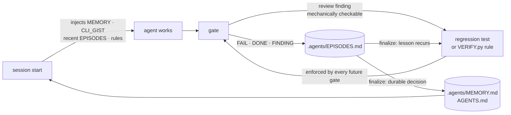

# defuss-vae

**V**erified **A**gentic **E**ngineering: your coding agent ships only what it has proven works.

Five skills that you trigger yourself, plus small stdlib-only Python programs that **verify, gate and remember**. The agent does the work; programs, not prompts, decide whether that work is done.

## TL;DR

Coding agents say "done" too early. They skip tests, mock away the bug, leave debug prints behind, and forget the same lesson every session. Telling the agent "please run the tests" in a prompt doesn't fix that, because the agent can always choose to ignore the prompt.

defuss-vae moves the checks out of the prompt and into code. Hooks deny `git commit` and send the agent back to work when it stops early, until the current code passes **verify → review → docs**. Lessons from failures are written into the project, so the next session starts smarter.

- 🔒 **Hard gate:** `git commit` is denied until the exact code fingerprint is verified, reviewed and documented
- 📝 **Docs are gated too:** every changed page passes a static prose check (em dashes, invisible or look-alike characters, broken links, fences and diagrams) and a review against a universal prose catalog
- 🧯 **Fails closed:** a crashing gate blocks instead of waving changes through
- 🧪 **Real evidence:** lint, tests (no mocks), coverage ≥ 60 %, and an e2e run against the built artifact that must leave fresh output
- ♻️ **Cached by content:** unchanged code is never re-verified, so review/docs loops stay fast
- 🧠 **Learns per project:** failures become episodes, recurring ones become tests or verifier rules, and memory is loaded into every new session
- 🧭 **Adapts to your repo:** uses your Makefile, your toolchain and your rules, and grows its policy from your own mistakes
- 🙋 **Human in charge:** skills never trigger themselves, and nothing is pushed or released without you
- 🪶 **Tiny:** `python3` ≥ 3.9, `git`, `make`; no dependencies, no daemon, no `uv` in the hook path

## How it works


| Stage | Who drives it | What it does |
|---|---|---|
| **plan** | you trigger, agent works | Traces the real code path, probes unknowns instead of guessing, prefers existing helpers and stdlib, and emits the smallest plan in which every acceptance criterion is an executable check. |
| **implement** | you trigger, fully agentic | Understands first, fixes the root cause (and its sibling callers), writes the minimum code, adds tests against real subsystems, and loops the gate in-turn. |
| **gate** | hooks, automatic | **verify** runs the project's own `make` verbs; **review** checks requirements, every changed path and its callers; **docs** records *why* this design beats the plausible alternative. Doc pages get a static prose check and a review against the prose catalog instead of the test suites. Any edit changes the fingerprint and restarts the gate. |
| **docs** | you trigger, any time | Writes and checks documentation pages: claims grounded in code and tests, page-specific rules declared before writing, Mermaid where the content is schematic, then the static prose check and a catalog review. |
| **finalize** | you trigger | Splits the work into coherent Conventional Commits, updates `CHANGELOG.md`, reconciles agent memory, promotes recurring lessons into tests or `.agents/VERIFY.py` rules, and updates the managed block in `AGENTS.md`. |
| **human review** | you | You read the commits. Nothing has been pushed yet. |
| **release** | you, via CI/CD | Push, tag, publish to package managers. On GitHub, `init` adds `.github/workflows/verify.yml` (`make setup && make verify`), so CI runs the same gate. |

## It adapts to your project

defuss-vae doesn't ship one-size-fits-all checks. It enforces a small **contract**, and each project fills that contract with its own commands and grows it with its own lessons.

- **Your commands, not autodiscovery.** The verifier runs your `Makefile` verbs (`make lint`, `make test`, `make coverage`, `make e2e`), so Python, TypeScript, Go and Rust all go through the same gate. `.agents/VERIFY.py` can point any check at a different command. *Why:* guessing runners per ecosystem would verify commands the project never committed to.
- **Your toolchain stays.** A repo already on npm, poetry or anything else keeps it; migrating needs your approval. Only *new* projects start on `bun` or `uv`, and the gate rejects foreign lockfiles that newly appear.
- **Scaffolds only what's missing.** `vae.py init` adds `.agents/`, a template `Makefile`, `.gitignore` lines, a managed `AGENTS.md` block and (on GitHub) the CI workflow. It never overwrites files the project already has.
- **Executable policy that grows.** `.agents/VERIFY.py` is project-local Python config plus deterministic rules (`command`, `file_exists`, `contains`, `regex`, `not_regex`). When review finds a bug class that can be checked mechanically, it becomes a regression test or a rule, which every future gate then enforces.
- **Rules per doc page.** Every page is under the built-in prose check from the moment it exists. A page with its own invariant (a required section, a diagram that must stay) gets a `.agents/VERIFY.py` rule before it is written, and a page whose house style needs a flagged character (German `„“` quotes, say) allows it via `CONFIG["prose"]["allow"]`.
- **Memory that's actually loaded.** The gate logs `FAIL`/`DONE`/`FINDING` lines to `.agents/EPISODES.md`. `finalize` folds durable lessons into `.agents/MEMORY.md` (≤ 4 KiB) and the commands that worked into `.agents/CLI_GIST.md` (≤ 2 KiB). The SessionStart hook injects all of it into every new session, so lessons don't depend on the agent remembering to read a file.



Lessons are ranked by strength: **test or `VERIFY.py` rule > MEMORY line > EPISODES line**. The strongest form is one a program enforces.

## Install

Requirements: `python3` ≥ 3.9, `git`, `make`. Hooks and CLI are stdlib-only.

### Claude Code (recommended: plugin, includes hooks)

Inside Claude Code:

```text
/plugin marketplace add kyr0/defuss-vae
/plugin install defuss-vae@defuss-vae
```

Or from your shell:

```bash
claude plugin marketplace add kyr0/defuss-vae
claude plugin install defuss-vae@defuss-vae
```

Start a new session afterwards. Update with `/plugin marketplace update defuss-vae`. To use a local checkout instead: `claude --plugin-dir "$PWD/plugin"`.

- **Good for:** the full experience, with the commit gate, the Stop-hook gate, and memory injected at session start.

### Codex (plugin)

`plugin/plugin.json` (Agent Plugins 1.0) + `plugin/.codex-plugin/plugin.json`; trust the hooks via `/hooks`.

- **Drawbacks:** hook parity with Claude Code is untested, see [`docs/COMPATIBILITY.md`](docs/COMPATIBILITY.md).

### Cursor, Gemini CLI, Copilot, Windsurf and more (skills only)

The open [`skills`](https://www.npmjs.com/package/skills) CLI detects your agents and installs the skills into any Agent Skills host:

```bash
npx skills add kyr0/defuss-vae --skill '*'
```

Pick agents with repeated `--agent` (`claude-code`, `codex`, `cursor`, `gemini-cli`, `github-copilot`, `windsurf`, or `'*'`) and skills with repeated `--skill`. Add `--global` (`-g`) for all projects, `--yes` (`-y`) for scripts, or `--list` to see what's available:

```bash
npx skills add kyr0/defuss-vae --skill plan --skill implement --agent codex --agent cursor
npx skills add kyr0/defuss-vae --skill '*' --agent codex --global --yes
npx skills update
```

- **Good for:** bringing the plan/implement/review/docs/finalize discipline to any agent.
- **Drawbacks:** this route copies only `plugin/skills/`, with **no hooks and no CLI**. Nothing blocks `git commit`, and the skills' `vae.py` path doesn't resolve. Clone the repo once and run the gate yourself:

```bash
git clone https://github.com/kyr0/defuss-vae ~/defuss-vae
python3 ~/defuss-vae/plugin/scripts/vae.py gate --repo .
```

In Claude Code prefer the plugin: its skills are namespaced (`/defuss-vae:plan`), while skills-CLI installs are not (`/plan`).

## Usage

Skills are **human-triggered only**, so the agent never invokes them on its own:

```text
/defuss-vae:plan add rate limiting to the upload endpoint
/defuss-vae:implement
/defuss-vae:review          # optional extra pass; the gate already runs a review
/defuss-vae:docs rewrite the README for first-time users
/defuss-vae:finalize
```

In Codex: `$plan add rate limiting to the upload endpoint`, then `$implement`, `$review`, `$docs`, `$finalize`.

The gate itself needs no command. When the agent tries to finish, or to `git commit`, the hooks run it and hand back exactly what's missing.

## CLI

```bash
python3 plugin/scripts/vae.py init   --repo .   # scaffold what's missing (.agents/, Makefile, .gitignore, AGENTS.md, CI)
python3 plugin/scripts/vae.py gate   --repo .   # verify → review → docs; exit 0 when done
python3 plugin/scripts/vae.py verify --repo .   # verifier only
python3 plugin/scripts/vae.py prose  --repo .   # static prose check of every doc page; --fix applies safe replacements
python3 plugin/scripts/vae.py doctor --repo .   # memory budgets, epistemic tags, layout
```

## What "verified" means

The verifier passes only with direct evidence for **all** of the following. A missing command or metric counts as `UNKNOWN`, and `UNKNOWN` fails.

- `.agents/VERIFY.py` is present and every one of its rules holds
- `make verify` is wired to `lint test coverage e2e`, and lint passes
- tests exist and pass, using real subsystems instead of mock frameworks
- e2e builds the publishable artifact, consumes it like a user, and leaves fresh evidence in `output/`
- coverage ≥ 60 % (`make coverage` prints `TOTAL <n>%`)
- no leftover temporary probe lines, no newly added foreign toolchain, and an `.env.example` that lists every config key
- every changed doc page passes `vae.py prose`. A session that changed only pages runs this check and the project rules, and skips the test suites

The layout is the same everywhere: `Makefile` verbs `setup start stop status log metrics bench test coverage lint e2e verify`; services log to `var/log/<svc>.stdout|.stderr` with a pid in `tmp/<svc>.pid`; programs read `input/` and write `output/`; config comes from a gitignored `.env`, with every key listed in a committed `.env.example`.

## Enforcement boundary

`VERIFIED:` hooks prove command results, fingerprints, layout and commit gating, and the e2e suite drives the released zip's own hook adapter to show it.
`UNKNOWN:` review *quality* is still a model property: the gate checks that a complete, current review attestation exists, not that the review was insightful. That's why human review sits before release.

## Details

- Prose catalog for doc pages: [`plugin/references/PROSE.md`](plugin/references/PROSE.md)
- Prompt and rule design: [`docs/PROMPT_DESIGN.md`](docs/PROMPT_DESIGN.md); the canonical Signan dialect: [`plugin/references/SIGNAN.md`](plugin/references/SIGNAN.md)
- Gate and verifier design: [`docs/VERIFIER.md`](docs/VERIFIER.md); host support: [`docs/COMPATIBILITY.md`](docs/COMPATIBILITY.md)
- Contributing: [`AGENTS.md`](AGENTS.md); run `make setup && make verify`

## License

MIT
